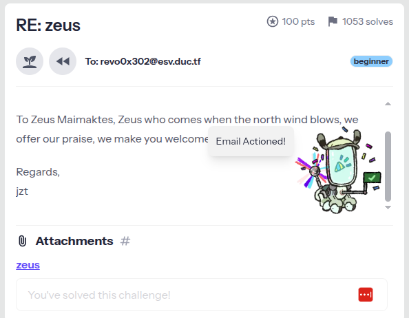
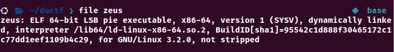
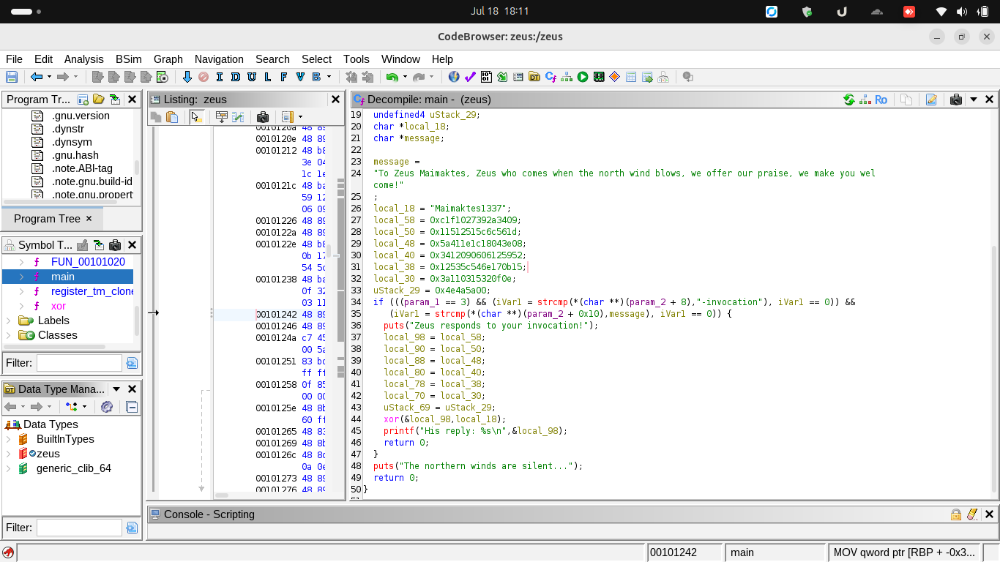
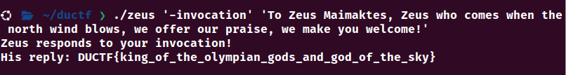

# DownunderCTF zeus write-up

Type: Article

# Zeus



Well, this is zeus challenge from DownunderCTF, from the first look the attachment look like a binary executable file, but we need to check using `file` commend after download.



yeah as i expected it’s an ELF 64-bit binary, which means it’s a reverse engineering challenge and we need a tool to reverse engineer the ELF binary. An example of the tools we can use are as follow:

- Ghidra (both assembly and souce code)
- IDA (assembly for free version)
- GDB debugger (assembly) [better use GEF on top of it for better experience)
- Radare
- …

those are some options, in my case the most straight forward one is Ghidra so i installed ghidra it’s free and open source i guess. After importing the binary to ghidra and analyse the `main` function we got the following



In the screenshot i already change the name of the message into `message` , initially it was a weird name. We will ignore the variables for now some of them are used for other purposes, we will focus on understanding first the program and what it does. 

First there is an `if` statement, let understand it

```c
if (((param_1 == 3) && (var = strcmp(*(char **)(param_2 + 8), "-invocation"), var == 0)) && (var = strcmp(*(char **)(param_2 + 0x10), message), var == 0)) {
 puts("zeus respond to your invocation!")
 ...
 print("hist reply: %s\n", &var)
 return 0
puts("The northern winds are silent...")

============== ACTUAL C CODE =======
The actuall C code would look like this
if ((argc == 3) && (argv[1] == "-invocation") && (argv[2] == message)) {
	print("hist reply: %s\n", &flag)
} else {
	print("The northern winds are silent...")
}
```

in the Ghidra code the `+ 8` and `+ 0x10` are offsets of the parameters in the `stack` memory.

Now that we got the actual `C` code we know we should pass `-invocation` and the `message` as parameters to `./zeus` ELF binary to get the Flag

```c
./zeus '-invocation' 'To Zeus Maimaktes, Zeus who comes when the north wind blows, we offer our praise, we make you welcome!'
```



The content of the flag is horrible though!!
